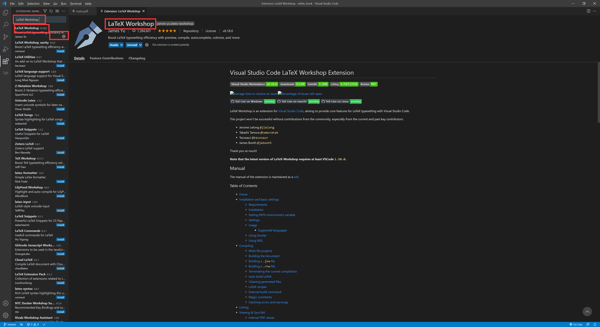
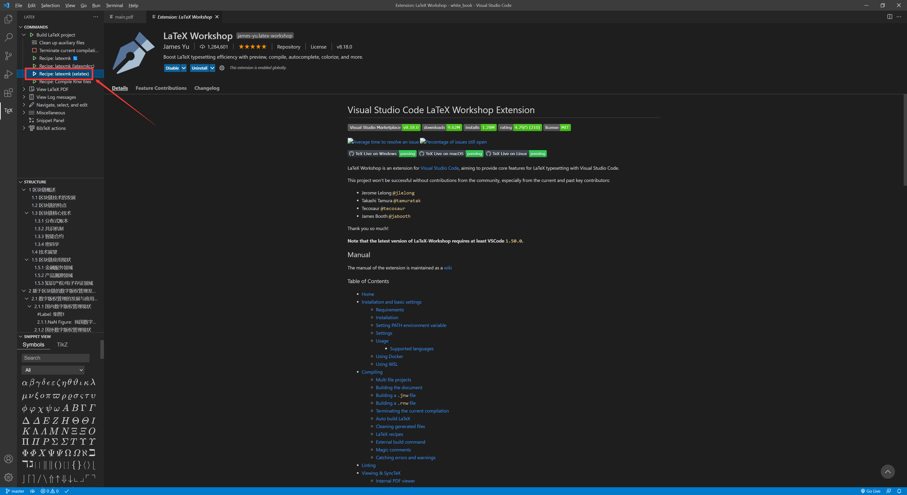

## VS Code 的环境搭建

### 自行安装 VS Code

### 安装LaTeX Workshop插件

- 编辑`C:\Users\{用户名}\AppData\Roaming\Code\User\settings.json`文件

- 在 `{}` 中加入以下内容

  ~~~json
  "latex-workshop.view.pdf.viewer": "tab",
  "[latex]": {
  
      "editor.formatOnPaste": false,
      "editor.suggestSelection": "recentlyUsedByPrefix", 
      "editor.wordWrap": "on"
  }, 
  "latex-workshop.latex.tools": [
      {
          "name": "latexmk",
          "command": "latexmk",
          "args": [
              "-synctex=1",
              "-interaction=nonstopmode",
              "-file-line-error",
              "-pdf",
              "-outdir=%OUTDIR%",
              "%DOC%"
          ],
          "env": {}
      },
      {
          "name": "xelatexmk",
          "command": "latexmk",
          "args": [
              "-synctex=1",
              "-interaction=nonstopmode",
              "-file-line-error",
              "-pdf",
              "-outdir=%OUTDIR%",
              "-xelatex",
              "%DOCFILE%"
          ],
          "env": {}
      },
      {
          "name": "latexmk_rconly",
          "command": "latexmk",
          "args": [
              "%DOC%"
          ],
          "env": {}
      },
      {
          "name": "bibtex",
          "command": "bibtex",
          "args": [
              "%DOCFILE%"
          ],
          "env": {}
      },
      {
          "name": "rnw2pdf",
          "command": "Rscript",
          "args": [
              "-e",
              "knitr::knit2pdf('%DOCFILE%')"
          ],
          "env": {}
      }
  ],
  "latex-workshop.latex.recipes": [
      {
          "name": "latexmk 🔃",
          "tools": [
              "latexmk"
          ]
      },
      {
          "name": "latexmk (latexmkrc)",
          "tools": [
              "latexmk_rconly"
          ]
      },
      {
          "name": "latexmk (xelatex)",
          "tools": [
              "xelatexmk"
          ]
      },
      {
          "name": "Compile Rnw files",
          "tools": [
              "rnw2pdf"
          ]
      }
  ],
  "latex-workshop.latex.recipe.default": "lastUsed",
  "latex-workshop.intellisense.unimathsymbols.enabled": true,
  "latex-workshop.intellisense.package.enabled": true
  ~~~

## 使用 VS Code 编辑 & 渲染

单机选择左侧的TEX插件图标，并双击 Recipe: latexmk(xelatex)并等待，直到生成【与tex文件同名】.pdf

